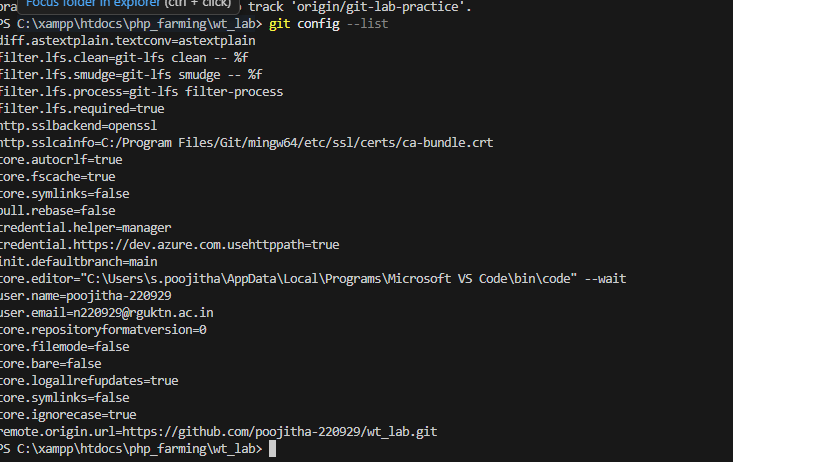
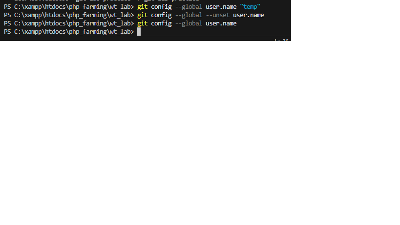

### command:
git config --list
### purpose:
displays all Git configuration settings
(username,email,core settings,etc).
### example:
git config --list
### syntax:
git config --list

## command:git config --global user.name
## syntax:
git config --global user.name "your name"
### purpose:
sets or displays the global username used for git commits.
### example:
git config --global user.name
### screenshot proof:
![Git username]
(global_username.png)

## command:git config --global user.email
## syntax:
git config --global user.name "your-email@example.com"
### purpose:
sets or displays the global email used for git commits.
### example:
git config --global user.email
### screenshot proof:

## Command: git config --unset
### Syntax:
git config --global --unset user.name
### Purpose:
Removes a specific Git configuration setting.
### Example:
git config --global --unset user.name
### Screenshot Proof:

